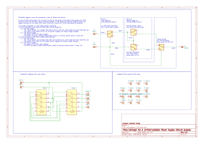

# Introduction

In case of UPS malfunction, the circuit will switch to the power of the Mains (that powers the UPS)
Since the UPS and the Mains source different phases, if the Phase and Netural switches would not 
happen precisely at the same time, there would be a chance for mixup and potential problems.

The solution proposed is a two stage double-switching: 
1. On the transition from Mains to UPS (UPS working properly):
   1. In the first stage:
      - The 'Power Switch' will change from Mains line to UPS line, which does not carry electricty yet.
      - The power to the Mains line is cut off (which triggers the second stage change)
   2. In the second stage:
      - The power of the UPS gets enabled
      - The Mains line gets a second deactivation (useful to prevent abrubt switch in step 2.1)
2. On the transition from UPS to Mains (UPS failure):
   1. In the first stage:
      - The 'Power Switch' will change from UPS line to Mains line, which does not carry electricty yet.
      - The power to the UPS line is enabled (which triggers the second stage change)
   2. In the second stage:
      - The power of the Main gets enabled
      - The UPS line gets a second deactivation (useful to prevent abrubt switch in step 1.1)

# Schematics

KiCad Application: KiCad Symbol Editor x64 on x64
* Version: 7.0.10, release build
* Platform: Windows 11 (build 22621), 64-bit edition, 64 bit, Little endian, 

# Parts

* 2 HH54 Relays
